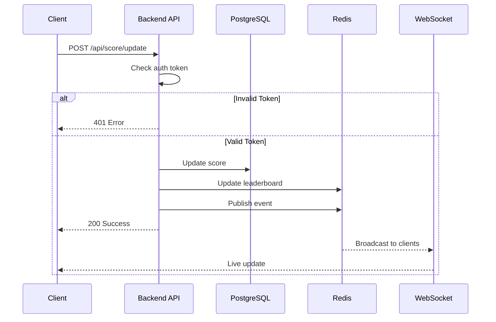

## Live Scoreboard API - Backend Architecture

### Overview

Design a backend API system for a real-time leaderboard that displays the top 10 users by score. When a user completes an action, their score increases and all connected clients should see the update in real-time.

**Requirements:**

- Show top 10 users on leaderboard
- Update scores in real-time for all users
- Prevent cheating/unauthorized score changes
- Handle high traffic efficiently

---

## API Flow Diagram


---

## System Architecture

**Components:**

- **API Layer**: REST endpoints + WebSocket for real-time updates
- **Database (PostgreSQL)**: Stores user scores and audit logs
- **Redis**: Fast leaderboard queries using Sorted Sets
- **Pub/Sub**: Broadcasts score changes to all connected clients

**How it works:**

1. User completes action → Frontend calls API
2. Backend verifies authentication
3. Update score in database
4. Update Redis leaderboard cache
5. Broadcast update via WebSocket to all clients

---

## Database Schema

**PostgreSQL Tables:**

```sql
-- Users table
users (id, handle, created_at)

-- Current scores
user_scores (user_id, score BIGINT, updated_at, version)

-- Audit log (history of all score changes)
score_events (id UUID, user_id, delta SMALLINT, action_id, created_at, metadata)

-- Prevent duplicate requests
idempotency_keys (idempotency_key, user_id, created_at, consumed_at)
```

Note: `delta` is how much the score changed (e.g., +1, +5, -2). This keeps a complete history.

**Redis:**

- `leaderboard:zset` - Sorted set for fast leaderboard queries (user_id → score)
- `leaderboard:top10` - Cached JSON of top 10 (optional)
- `leaderboard:pub` - Pub/Sub channel for broadcasting updates

**Why this design:**

- PostgreSQL = reliable, durable storage (source of truth)
- Redis = fast reads for leaderboard (sorted sets are O(log N))
- Separate cache and database = better performance

---

## API Endpoints

Base URL: `/api`  
Authentication: `Authorization: Bearer <token>`

### 1. Get Top Scores

```
GET /api/scores/top?limit=10
```

**Response:**

```json
{
  "top": [
    { "userId": "123", "handle": "alice", "score": 1203 },
    { "userId": "456", "handle": "bob", "score": 1190 }
  ],
  "asOf": "2025-10-31T12:00:00Z"
}
```

### 2. Get My Score

```
GET /api/scores/me
```

**Response:**

```json
{
  "userId": "123",
  "handle": "alice",
  "score": 1203,
  "rank": 9
}
```

### 3. Update Score

```
POST /api/score/update
Headers: Authorization: Bearer <token>
```

**Flow:**

1. Verify user is authenticated
2. Increment score in database
3. Update Redis cache
4. Broadcast to all clients via WebSocket

**Response:**

```json
{
  "userId": "123",
  "newScore": 1204,
  "success": true
}
```

**Errors:**

- `401` - Not authenticated
- `429` - Too many requests (rate limited)
- `500` - Server error

### 4. Real-time Updates (WebSocket)

```
WS /api/ws/leaderboard
```

**Messages sent to clients:**

```json
// Initial snapshot
{ "type": "snapshot", "top": [ {...}, {...} ] }

// Score updated
{ "type": "update", "userId": "123", "score": 1204 }

// User fell off leaderboard
{ "type": "remove", "userId": "999" }
```

---

## Security & Anti-Abuse

**Threats to prevent:**

1. Users adding fake scores
2. Bots/scripts spamming increments
3. One user manipulating others' scores

**Solutions:**

1. **Authentication**: Require valid JWT token
2. **Authorization**: Users can only update their own score
3. **Rate Limiting**: Max 10 updates/minute per user
4. **Idempotency**: Same request ID = same result (prevents duplicates)
5. **Audit Log**: Keep all score changes in database
6. **HTTPS**: Encrypt all traffic

---

## Execution Flow

### Simple Flow (Diagram Above)



---

## Error Handling

**Standard error format:**

```json
{
  "error": {
    "code": "UNAUTHORIZED",
    "message": "Invalid authentication token"
  }
}
```

**Common error codes:**

- `UNAUTHORIZED` - Missing/invalid token
- `RATE_LIMITED` - Too many requests
- `VALIDATION_FAILED` - Invalid input
- `INTERNAL_ERROR` - Server issue

---

## Testing Strategy

**Unit Tests:**

- Score calculation logic
- Authentication validation
- Rate limiting logic

**Integration Tests:**

- Full flow: API → Database → Redis → WebSocket
- Concurrent score updates
- WebSocket connection/disconnection

**Load Tests:**

- 1000+ simultaneous users
- High-frequency score updates
- WebSocket connections

---

## Edge Cases

**What to consider:**

- New users (start at 0)
- Tied scores (break by time, then ID)
- Database connection fails (handle gracefully)
- Redis down (fallback to database)
- WebSocket disconnect (reconnect with latest data)
- User deletes account (remove from leaderboard)

---

## Implementation Checklist

**Phase 1 - Core Features**

- [ ] Database schema and migrations
- [ ] Get top scores endpoint
- [ ] Update score endpoint
- [ ] Basic authentication

**Phase 2 - Real-time**

- [ ] WebSocket connection
- [ ] Broadcast score updates
- [ ] Handle client reconnection

**Phase 3 - Security**

- [ ] Rate limiting
- [ ] Idempotency handling
- [ ] Audit logging

**Phase 4 - Performance**

- [ ] Redis caching
- [ ] Database indexes
- [ ] Load testing

---

## Key Technologies

- **Backend**: Node.js/Express, Python/FastAPI, or Go (your choice)
- **Database**: PostgreSQL
- **Cache**: Redis
- **Real-time**: WebSockets (Socket.io or native)
- **Authentication**: JWT tokens
- **Monitoring**: Logs, metrics, error tracking

---

## Author

Bui Cong Vinh  
Completed: 28/10/2025
