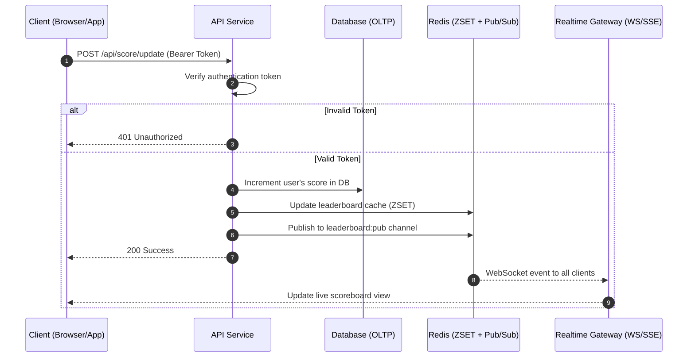

## API Module Specification: Live Scoreboard Service

### Overview

This module provides backend APIs and realtime streaming for a website leaderboard that displays the top 10 users by score. Users perform an action (details out of scope) and, upon completion, the client dispatches an authenticated request to increment the user’s score. The service must stream live updates to all connected clients, prevent unauthorized/malicious score inflation, and scale under bursty traffic.

### Goals

- Maintain a global leaderboard showing top N (default 10) scores.
- Realtime updates to connected clients when scores change.
- Authoritative, tamper-resistant score increments with auditing and anti-abuse controls.
- Low latency (<200ms p95) for increment-to-broadcast under normal load.

### Non-Goals

- The details of the client-side action are out of scope.
- Full user management and authentication provider are assumed to exist upstream.

---

## API Flow Diagram

The following diagram illustrates the complete flow for updating a user's score and broadcasting changes to all connected clients:


---

## Architecture

- API layer (REST + WebSocket/SSE gateway)
- Score Service (domain logic, validation, anti-abuse, auditing)
- Caching/Leaderboard store: Redis Sorted Set (primary for leaderboard queries/broadcasts)
- OLTP database (PostgreSQL/MySQL) for durable audit log and source-of-truth user scores
- Pub/Sub (Redis Pub/Sub or message broker) for fan-out to realtime gateway instances

Recommended pattern:

- Redis ZSET keeps the live leaderboard with O(log N) updates via ZINCRBY.
- Database keeps an append-only `score_events` audit and an upserted `user_scores` aggregate.
- On increment: write audit event, update DB aggregate in a transaction, update Redis ZSET, then publish a leaderboard-diff event.
- Realtime gateway broadcasts the minimal diff to clients; periodic full snapshots ensure consistency.

---

## Data Model

Tables (RDBMS):

- `users` (id, handle, created_at)
- `user_scores` (user_id PK/FK, score BIGINT NOT NULL DEFAULT 0, updated_at, version INT)
- `score_events` (id UUID PK, user_id, delta SMALLINT, action_id UUID, created_at, metadata JSONB)
- `idempotency_keys` (idempotency_key PK, user_id, created_at, consumed_at)

Redis:

- `leaderboard:zset` — ZSET mapping `user_id -> score`
- `leaderboard:top10` — cached JSON snapshot (optional)
- `leaderboard:pub` — Pub/Sub channel for diffs `{ type: "score_update", userId, score }`

Indexes:

- `user_scores(user_id)` unique
- `score_events(user_id)`; `score_events(action_id)` unique if applicable
- `idempotency_keys(idempotency_key)` unique

Concurrency & Consistency:

- Use DB row-level locking (`SELECT ... FOR UPDATE`) or optimistic concurrency via `version` on `user_scores` to avoid lost updates.
- Applying increments is idempotent via an `idempotency_key` supplied by the client; duplicates are dropped.

---

## Security and Anti-Abuse

Threats to mitigate:

- Unauthorized users calling the increment API for others
- Replay or scripted mass increments by the same user
- Tampering with increment magnitude

Controls:

- Authentication: OAuth2/JWT Bearer access token; scopes include `scores:write` for increments and `scores:read` for queries.
- Authorization: user in token must match the incremented user. No admin override via this public API.
- Increment magnitude: client never sends arbitrary delta; server infers delta=1 (or configured) from a signed Action-Completion Token.
- Action-Completion Token (ACT): short-lived, single-use JWT minted by the server during/after action validation; claims: `sub` (user_id), `inc` (1), `exp`, `jti`, `purpose: score_increment`. The increment API accepts only this token; server validates signature, expiration, and `jti` single-use via a consume store.
- Idempotency: client supplies `Idempotency-Key` header (UUID v4). Duplicates within a retention window (e.g., 24h) are no-ops.
- Rate limiting: token-bucket on `scores:increment` per user and per IP.
- Anomaly detection: velocity checks (e.g., max 5 increments/min), alerting if exceeded; optionally shadow-disable increments.
- Transport security: HTTPS/TLS only; HSTS enabled at edge.

---

## API Specification

Base path: `/api`

Authentication: `Authorization: Bearer <access_token>` (standard user auth) unless noted.

Idempotency: For mutating endpoints, include `Idempotency-Key: <uuid>`.

### 1) Get Top Scores

- Method/Path: `GET /api/scores/top?limit=10`
- Auth: optional (public read)
- Query params:
  - `limit` (int, 1..100; default 10)
- Response 200:

```json
{
  "top": [
    { "userId": "123", "handle": "alice", "score": 1203 },
    { "userId": "456", "handle": "bob", "score": 1190 }
  ],
  "asOf": "2025-10-31T12:00:00Z"
}
```

### 2) Get Current User Score

- Method/Path: `GET /api/scores/me`
- Auth: required
- Response 200:

```json
{ "userId": "123", "handle": "alice", "score": 1203, "rank": 9 }
```

### 3) Request Action-Completion Token (if applicable)

- Method/Path: `POST /api/actions/score-token`
- Auth: required
- Body: none (or contextual metadata if needed)
- Response 200:

```json
{ "actionToken": "<ACT JWT>", "expiresIn": 60 }
```

Notes:

- This endpoint is used if the action is client-observable but validated server-side. If the action occurs entirely server-side, the ACT may be minted internally and the client only calls increment with that token.

### 4) Increment Score (authoritative)

- Method/Path: `POST /api/scores/increment`
- Auth: required (access token)
- Headers:
  - `Idempotency-Key: <uuid>`
- Body:

```json
{ "actionToken": "<ACT JWT>" }
```

- Response 200:

```json
{
  "userId": "123",
  "newScore": 1204,
  "applied": true,
  "top10Changed": true
}
```

- Error cases:
  - 400 invalid/missing body
  - 401/403 auth failed or token user mismatch
  - 409 idempotency conflict already processed (return prior result)
  - 422 invalid/expired/consumed actionToken
  - 429 rate limit exceeded

### 5) Realtime Leaderboard Stream

Option A (preferred): WebSocket

- Path: `GET /api/ws/leaderboard`
- Protocol: WS(S). After connect, server pushes events.
- Messages (server->client):

```json
{ "type": "snapshot", "top": [ {"userId":"...","handle":"...","score":123}, ... ], "asOf":"..." }
{ "type": "upsert",  "userId": "123", "score": 1204 }
{ "type": "remove",  "userId": "999" }
```

Clients maintain a local top-10 using upsert/remove diffs.

Option B: Server-Sent Events (SSE)

- Path: `GET /api/scores/stream`
- Event types: `snapshot`, `upsert`, `remove`

---

## Execution Flow

### Simple Increment Flow (as shown in diagram above)



### Complete Flow (with ACT)

For the full implementation with Action-Completion Token (ACT) security:

```mermaid
sequenceDiagram
  autonumber
  participant C as Client (Browser/App)
  participant G as Realtime Gateway (WS/SSE)
  participant A as API Service
  participant S as Score Service
  participant R as Redis (ZSET + Pub/Sub)
  participant D as Database (OLTP)

  C->>G: Connect WS /api/ws/leaderboard
  G-->>C: snapshot(top10)

  C->>A: POST /api/actions/score-token (Bearer)
  A->>S: mint ACT for user
  S->>D: record jti (reserve)
  S-->>A: actionToken (ACT)
  A-->>C: { actionToken }

  C->>A: POST /api/scores/increment (Idempotency-Key, ACT)
  A->>S: validate auth, rate-limit, ACT (sig, exp, jti)
  S->>D: txn{ insert score_events; upsert user_scores; consume jti }
  S->>R: ZINCRBY leaderboard:zset
  S->>R: PUBLISH leaderboard:pub { userId, score }
  S-->>A: { newScore, top10Changed }
  A-->>C: 200 { newScore }
  R-->>G: pubsub message
  G-->>C: upsert(userId, score)
```

---

## Validation and Idempotency

Increment application is governed by:

- ACT validation: signature, `purpose`, `exp`, single-use `jti` consumed atomically in the DB transaction.
- Idempotency: `Idempotency-Key` ties to the `(user_id, endpoint)` and stores the final response payload; on duplicate, return stored response.
- Rate-limits: per-user and per-IP with distinct buckets; encoded in Redis with sliding window or token bucket.

---

## Error Model

Standard error payload:

```json
{ "error": { "code": "ACT_EXPIRED", "message": "Action token expired" } }
```

Representative codes: `UNAUTHORIZED`, `FORBIDDEN`, `RATE_LIMITED`, `IDEMPOTENT_REPLAY`, `ACT_INVALID`, `ACT_EXPIRED`, `ACT_CONSUMED`, `VALIDATION_FAILED`, `CONFLICT`, `INTERNAL_ERROR`.

---

## Observability

- Structured logging: request id, user id, idempotency key, ACT jti, delta, new score.
- Metrics: increment latency, ACT validation failures, rate-limit hits, pubsub lag, WS connected clients, broadcast fan-out latency.
- Tracing: span across API → Score Service → DB/Redis.

---

## Deployment & Scalability

- Stateless API instances; sticky sessions not required.
- Redis cluster for ZSET and rate limiting; enable keyspace notifications for auxiliary invalidations if used.
- DB with primary/replica; write only to primary. Consider partitioning `score_events` by time.
- Horizontal scale of realtime gateway; subscribe all to `leaderboard:pub`.
- Cold start recovery: rebuild Redis ZSET from `user_scores` on boot or scheduled reconciliation job.

---

## Test Strategy

- Unit: ACT validation, idempotency behavior, rank calculation, diff generation.
- Integration: increment transactionality (events + aggregates), Redis ZINCRBY, Pub/Sub to WS.
- Security: replay ACT, expired ACT, user mismatch, flood increments under rate limits.
- Load: simulate bursts of increments and connected WS clients; validate p95 latency.

---

## Backward/Edge Cases

- New users with zero scores: appear after first increment or when explicitly included.
- Ties in score: break by earliest `updated_at` ascending, then `user_id`.
- Negative increments: not supported via public API.
- Account deletion: remove from ZSET and mask in snapshots; keep `score_events` for audit or purge by policy.

---

## Additional Improvement Suggestions

- Bot mitigation: add proof-of-work or device attestation for `scores:increment` in high-risk environments.
- Abuse heuristics: per-device and per-ASN velocity caps; temporary cool-downs.
- Regional shards: per-region ZSETs with periodic merge for global leaderboard.
- Snapshot compression: delta-compressed streams for large leaderboards beyond top-10.
- GDPR/Privacy: minimize PII; expose `handle` only if user opted-in to public leaderboard.
- Feature flags: dynamically switch between WS and SSE; adjustable increment value.

---

## Implementation Checklist (for the engineering team)

- [ ] Define JWT issuer and keys for ACT; implement mint and consume flows
- [ ] Implement `POST /api/scores/increment` with idempotency, rate limiting, ACT validation
- [ ] Implement Redis ZSET updates and Pub/Sub publish
- [ ] Implement WS `/api/ws/leaderboard` gateway with snapshot + diff
- [ ] Implement `GET /api/scores/top` and `GET /api/scores/me`
- [ ] Implement reconciliation job between DB `user_scores` and Redis ZSET
- [ ] Add metrics, logs, tracing, and dashboards
- [ ] Add load tests and security tests
